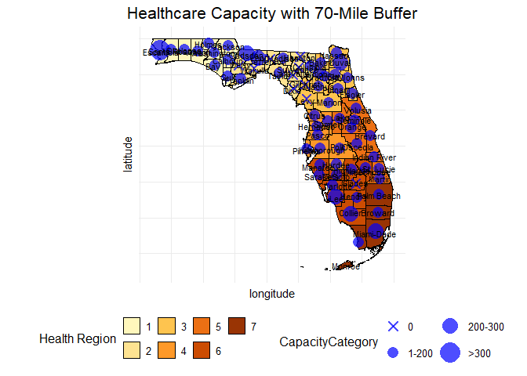
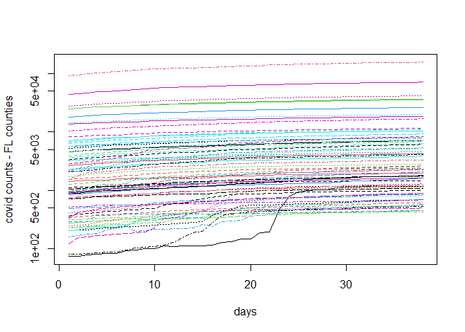

SIR_Estimation_Florida
================
Seyedreza (reza) Abazari
11/14/2025

# Overview

This document plots Florida Healthcare Coalitions and estimates **SIR
model parameters (β, γ, R₀)** for  
**Florida counties** using county-level COVID-19 data.

Plot Healthcare Coalitions

``` r
### Libraries ----
library(ggplot2)
library(sf)
```

    ## Linking to GEOS 3.12.2, GDAL 3.9.3, PROJ 9.4.1; sf_use_s2() is TRUE

``` r
library(tigris)
```

    ## To enable caching of data, set `options(tigris_use_cache = TRUE)`
    ## in your R script or .Rprofile.

``` r
library(ggrepel)
library(censusapi)
```

    ## 
    ## Attaching package: 'censusapi'

    ## The following object is masked from 'package:methods':
    ## 
    ##     getFunction

``` r
library(readxl)
library(dplyr)
```

    ## 
    ## Attaching package: 'dplyr'

    ## The following objects are masked from 'package:stats':
    ## 
    ##     filter, lag

    ## The following objects are masked from 'package:base':
    ## 
    ##     intersect, setdiff, setequal, union

``` r
library(this.path)
```

    ## Warning: package 'this.path' was built under R version 4.4.3

``` r
script_dir <- this.dir()

options(tigris_use_cache = TRUE)

### Load Florida county shapefile ----
florida_map <- counties(state = "FL", cb = TRUE, class = "sf")
```

    ## Retrieving data for the year 2022

``` r
### Load health region data ----
health_region <- read.csv(file.path(script_dir, "County.csv"))
health_region$county <- gsub(" County", "", health_region$county)

florida_map <- merge(
  florida_map, health_region,
  by.x = "NAME", by.y = "county"
)

### Census population data (2010) ----
AllCountyNames <- fips_codes$county[fips_codes$state_code == "12"]
AllCountyCodes <- fips_codes$county_code[fips_codes$state_code == "12"]

Sys.setenv(CENSUS_KEY = "0e95aa62e853f18e1d8099dbbc0ca054cdf14f81")
readRenviron("~/.Renviron")

fl2010_cnty <- getCensus(
  name = "dec/sf1",
  vintage = 2010,
  vars = c("H010001"),
  region = "county:*",
  regionin = "state:12"
)

fl2010_cnty$name <- AllCountyNames[match(fl2010_cnty$county, AllCountyCodes)]
fl2010_cnty$name <- gsub(" County", "", fl2010_cnty$name)

countyPopVec <- fl2010_cnty[, c("name", "H010001")]

### Hospital capacity data ----
cap <- read_excel(file.path(script_dir, "cap.xlsx"))
cap$County <- gsub(" County", "", cap$County)
cap <- cap[order(cap$County), ]

### Add raw capacity rate ----
cap <- cap %>%
  left_join(countyPopVec, by = c("County" = "name")) %>%
  rename(Population = H010001) %>%
  mutate(
    CapacityRate = (Staffed.All.Beds / Population) * 100000,
    CapacityCategory = cut(
      CapacityRate,
      breaks = c(0, 100, 200, 500, 1000, Inf),
      labels = c("<100", "100-200", "200-500", "500-1000", ">1000")
    )
  )

### 70-mile buffer calculations ----
dis <- read_excel(file.path(script_dir, "ordered_distance.xlsx"))
```

    ## New names:
    ## • `` -> `...1`

``` r
distance_matrix <- as.matrix(dis[, -1])
rownames(distance_matrix) <- cap$County
colnames(distance_matrix) <- cap$County

buffer_radius <- 70
within_buffer <- lapply(
  rownames(distance_matrix),
  function(county)
    colnames(distance_matrix)[distance_matrix[county, ] <= buffer_radius]
)
names(within_buffer) <- rownames(distance_matrix)

### Recalculate capacity using buffer populations ----
cap <- cap %>%
  rowwise() %>%
  mutate(
    Totalpop = sum(countyPopVec$H010001[countyPopVec$name %in% within_buffer[[County]]], na.rm = TRUE),
    CapacityRate = (Staffed.All.Beds / Totalpop) * 100000,
    CapacityCategory = cut(
      CapacityRate,
      breaks = c(-Inf, 0, 200, 300, Inf),
      labels = c("0", "1-200", "200-300", ">300")
    )
  ) %>%
  ungroup()

cap$CapacityCategory <- factor(cap$CapacityCategory, levels = c("0", "1-200", "200-300", ">300"))
cap$CapacityCategory[is.na(cap$CapacityCategory)] <- "0"

### County centroids ----
centroids <- st_centroid(florida_map)
```

    ## Warning: st_centroid assumes attributes are constant over geometries

``` r
coords <- st_coordinates(centroids) %>% as.data.frame()

florida_map <- florida_map %>%
  mutate(longitude = coords$X, latitude = coords$Y)

capacity_with_coords <- florida_map %>%
  left_join(cap, by = c("NAME" = "County"))

### Plot ----
ggplot(data = florida_map) +
  geom_sf(aes(fill = as.factor(region)), color = "black") +
  scale_fill_manual(
    values = c("#fff7bc", "#fee391", "#fec44f", "#fe9929",
               "#ec7014", "#cc4c02", "#993404"),
    name = "Health Region"
  ) +
  geom_point(
    data = capacity_with_coords,
    aes(x = longitude, y = latitude,
        size = CapacityCategory, shape = CapacityCategory),
    alpha = 0.7, color = "blue", stroke = 1.5
  ) +
  scale_size_manual(
    values = c("0" = 3, "1-200" = 4, "200-300" = 6, ">300" = 8)
  ) +
  scale_shape_manual(
    values = c("0" = 4, "1-200" = 16, "200-300" = 16, ">300" = 16)
  ) +
  geom_sf_text(aes(label = NAME), size = 3) +
  labs(title = "Healthcare Capacity with 70-Mile Buffer") +
  theme_minimal() +
  theme(
    legend.position = "bottom",
    plot.title = element_text(size = 16, hjust = 0.5),
    legend.text = element_text(size = 10),
    legend.title = element_text(size = 12),
    axis.text = element_blank(),
    axis.ticks = element_blank()
  ) +
  guides(
    size = guide_legend(nrow = 2),
    shape = guide_legend(nrow = 2),
    fill = guide_legend(nrow = 2)
  )
```

    ## Warning in st_point_on_surface.sfc(sf::st_zm(x)): st_point_on_surface may not
    ## give correct results for longitude/latitude data

<!-- -->

The computation uses:

- ODE solving via **deSolve**
- County shapefiles & FIPS codes via **tigris**
- Census population data

``` r
library(stringi)
library(ggplot2)
library(deSolve)
library(tigris)
library(lattice)
library(censusapi)
library(lubridate)
```

    ## 
    ## Attaching package: 'lubridate'

    ## The following objects are masked from 'package:base':
    ## 
    ##     date, intersect, setdiff, union

``` r
# functions to compile
SIR <- function(time, state, parameters) {
  par <- as.list(c(state, parameters))
  with(par, {
    dS = -beta/N*I*S
    dI = beta/N*I*S - gamma*I
    dR = gamma*I
    list(c(dS, dI, dR))
  })
}

# simulate SIR for 2 regions that commute to each other
SIR2Regions <- function(time, state, parameters) {
  x = as.matrix(state)
  S = x[1:2]
  I = x[3:4]
  R = x[5:6]
  with(as.list(parameters), {

    F_mat = matrix(0, ncol = 2, nrow = 2)
    
    dS = -beta/N*I*S + F_mat %*% S
    dI = beta/N*I*S - gamma*I + F_mat %*% I
    dR = gamma*I + F_mat %*% R
    
    list(c(dS, dI, dR))
  })
}
```

``` r
fitSIR = function(Infected, N, observedDays, endPoint) {
  RSS <- function(parameters, Infected, observedDays) {
    names(parameters) <- c("beta", "gamma")
    out <- ode(y = init, times = observedDays, func = SIR,
               parms = parameters, method = 'bdf')
    fit <- out[, 3]
    sum((Infected - fit)^2)
  }
  
  if (Infected[1] == 0) { Infected[1] = 1 }  # if first week is 0
  
  init <- c(S = N - Infected[1], I = Infected[1], R = 0)
  param0 = c(.1, 0.2)

  Opt <- optim(
    param0, RSS, method = "L-BFGS-B",
    lower = c(0, 0), upper = c(Inf, Inf),
    control = list(maxit = 20000),
    Infected = Infected, observedDays = observedDays
  )
  
  Opt_par <- setNames(Opt$par, c("beta", "gamma"))
  R0 = Opt$par[1] / Opt$par[2]

  fit <- data.frame(
    ode(y = init, times = seq(1, endPoint),
        func = SIR, parms = Opt_par, method = 'bdf')
  )

  return(list(fit = fit, SIRprm = Opt_par, R0 = R0))
}
```

``` r
# use NYTimes county level data
AllCountyNames = fips_codes$county[fips_codes$state_code=='12']
AllCountyCodes = fips_codes$county_code[fips_codes$state_code=='12']

Sys.setenv(CENSUS_KEY = "0e95aa62e853f18e1d8099dbbc0ca054cdf14f81")
readRenviron("~/.Renviron"); Sys.getenv("CENSUS_KEY")
```

    ## [1] "0e95aa62e853f18e1d8099dbbc0ca054cdf14f81"

``` r
options(tigris_use_cache = TRUE)

fl2010_cnty <- getCensus(
  name = "dec/sf1",
  vintage = 2010,
  vars = c("H010001"),
  region = "county:*",
  regionin = "state:12"
)

fl2010_cnty$name = AllCountyNames[
  match(fl2010_cnty$county, AllCountyCodes)
]

dfCovidDailyCounty3 =
  read.csv(file.path(script_dir,'countyLevelFL_DailyCovid_2020-2021.csv'))

dfCovidDailyCounty3 = dfCovidDailyCounty3[, -1]
dfCovidDailyCounty3$date = as.Date(dfCovidDailyCounty3$date)
datevec3 = unique(dfCovidDailyCounty3$date)
```

``` r
dfCovidDailyCounty4 = data.frame(
  county = fl2010_cnty$name,
  pop = fl2010_cnty$H010001,
  fip = paste('12', fl2010_cnty$county, sep = "")
)

N = 40  # daily data from 07/22/2020 to 10/19/2020
currentDay <- as.Date("07/22/2020", format = "%m/%d/%y")
dateVec = currentDay

for (i in 1:N) {
  newDf = dfCovidDailyCounty3[dfCovidDailyCounty3$date == currentDay, ]
  newCases = newDf$cases[
    match(as.numeric(dfCovidDailyCounty4$fip), newDf$fips)
  ]
  
  dfCovidDailyCounty4 = data.frame(dfCovidDailyCounty4, newcases = newCases)
  names(dfCovidDailyCounty4)[3 + i] = as.character(currentDay)
  
  day(currentDay) = day(currentDay) + 1
  dateVec = c(dateVec, currentDay)
}
```

``` r
matplot(
  t(dfCovidDailyCounty4[, 4:(N + 1)]),
  type='l', log='y',
  xlab='days', ylab='covid counts - FL counties'
)
```

<!-- -->

``` r
###########SIR model for all counties#################
noDays = N
countyNoVec = 1:67
countyNameVec = fl2010_cnty$name
countyPopVec = fl2010_cnty$H010001
observedDays = seq(1, noDays)
futureDays = seq(noDays, 300)

dfSIRResults.County = NA
betaa = NA
gammaa = NA

for (countyNo in 1:length(countyNoVec)) {
  #print(countyNo)
  CountyName = countyNameVec[countyNo]
  Infected = as.numeric(
    dfCovidDailyCounty4[
      dfCovidDailyCounty4$county == CountyName, -c(1,2,3)
    ]
  )
  
  N = countyPopVec[countyNo]
  res = fitSIR(Infected, N, observedDays, 300)
  
  
  betaa[countyNo] = res$SIRprm[1]
  gammaa[countyNo] = res$SIRprm[2]
  
  newDF = rbind(
    data.frame(Value=res$fit$S, type='S', County=CountyName, time=res$fit$time),
    data.frame(Value=res$fit$I, type='I', County=CountyName, time=res$fit$time),
    data.frame(Value=res$fit$R, type='R', County=CountyName, time=res$fit$time),
    data.frame(Value=Infected, type='Data', County=CountyName, time=observedDays)
  )
  
  dfSIRResults.County = rbind(dfSIRResults.County, newDF)
}
```

    ## DLSODE-  Warning..internal T (=R1) and H (=R2) are
    ##       such that in the machine, T + H = T on the next step  
    ##       (H = step size). Solver will continue anyway
    ## In above message, R1 = 1, R2 = 2.12586e-17
    ##  
    ## DLSODE-  Warning..internal T (=R1) and H (=R2) are
    ##       such that in the machine, T + H = T on the next step  
    ##       (H = step size). Solver will continue anyway
    ## In above message, R1 = 1, R2 = 2.12586e-17
    ##  
    ## DLSODE-  Warning..internal T (=R1) and H (=R2) are
    ##       such that in the machine, T + H = T on the next step  
    ##       (H = step size). Solver will continue anyway
    ## In above message, R1 = 1, R2 = 2.12586e-17
    ##  
    ## DLSODE-  Warning..internal T (=R1) and H (=R2) are
    ##       such that in the machine, T + H = T on the next step  
    ##       (H = step size). Solver will continue anyway
    ## In above message, R1 = 1, R2 = 2.12586e-17
    ##  
    ## DLSODE-  Warning..internal T (=R1) and H (=R2) are
    ##       such that in the machine, T + H = T on the next step  
    ##       (H = step size). Solver will continue anyway
    ## In above message, R1 = 1, R2 = 2.12586e-17
    ##  
    ## DLSODE-  Warning..internal T (=R1) and H (=R2) are
    ##       such that in the machine, T + H = T on the next step  
    ##       (H = step size). Solver will continue anyway
    ## In above message, R1 = 1, R2 = 2.12586e-17
    ##  
    ## DLSODE-  Warning..internal T (=R1) and H (=R2) are
    ##       such that in the machine, T + H = T on the next step  
    ##       (H = step size). Solver will continue anyway
    ## In above message, R1 = 1, R2 = 2.12586e-17
    ##  
    ## DLSODE-  Warning..internal T (=R1) and H (=R2) are
    ##       such that in the machine, T + H = T on the next step  
    ##       (H = step size). Solver will continue anyway
    ## In above message, R1 = 1, R2 = 2.12586e-17
    ##  
    ## DLSODE-  Warning..internal T (=R1) and H (=R2) are
    ##       such that in the machine, T + H = T on the next step  
    ##       (H = step size). Solver will continue anyway
    ## In above message, R1 = 1, R2 = 2.12586e-17
    ##  
    ## DLSODE-  Warning..internal T (=R1) and H (=R2) are
    ##       such that in the machine, T + H = T on the next step  
    ##       (H = step size). Solver will continue anyway
    ## In above message, R1 = 1, R2 = 2.12586e-17
    ##  
    ## DLSODE-  Warning..internal T (=R1) and H (=R2) are
    ##       such that in the machine, T + H = T on the next step  
    ##       (H = step size). Solver will continue anyway
    ## In above message, R1 = 1, R2 = 6.37758e-17
    ##  
    ## DLSODE-  Warning..internal T (=R1) and H (=R2) are
    ##       such that in the machine, T + H = T on the next step  
    ##       (H = step size). Solver will continue anyway
    ## In above message, R1 = 1, R2 = 6.37758e-17
    ##  
    ## DLSODE-  Warning..internal T (=R1) and H (=R2) are
    ##       such that in the machine, T + H = T on the next step  
    ##       (H = step size). Solver will continue anyway
    ## In above message, R1 = 1, R2 = 6.37758e-17
    ##  
    ## DLSODE-  Warning..internal T (=R1) and H (=R2) are
    ##       such that in the machine, T + H = T on the next step  
    ##       (H = step size). Solver will continue anyway
    ## In above message, R1 = 1, R2 = 6.37758e-17
    ##  
    ## DLSODE-  Warning..internal T (=R1) and H (=R2) are
    ##       such that in the machine, T + H = T on the next step  
    ##       (H = step size). Solver will continue anyway
    ## In above message, R1 = 1, R2 = 6.37758e-17
    ##  
    ## DLSODE-  Warning..internal T (=R1) and H (=R2) are
    ##       such that in the machine, T + H = T on the next step  
    ##       (H = step size). Solver will continue anyway
    ## In above message, R1 = 1, R2 = 6.37758e-17
    ##  
    ## DLSODE-  Warning..internal T (=R1) and H (=R2) are
    ##       such that in the machine, T + H = T on the next step  
    ##       (H = step size). Solver will continue anyway
    ## In above message, R1 = 1, R2 = 6.37758e-17
    ##  
    ## DLSODE-  Warning..internal T (=R1) and H (=R2) are
    ##       such that in the machine, T + H = T on the next step  
    ##       (H = step size). Solver will continue anyway
    ## In above message, R1 = 1, R2 = 6.37758e-17
    ##  
    ## DLSODE-  Warning..internal T (=R1) and H (=R2) are
    ##       such that in the machine, T + H = T on the next step  
    ##       (H = step size). Solver will continue anyway
    ## In above message, R1 = 1, R2 = 6.37758e-17
    ##  
    ## DLSODE-  Warning..internal T (=R1) and H (=R2) are
    ##       such that in the machine, T + H = T on the next step  
    ##       (H = step size). Solver will continue anyway
    ## In above message, R1 = 1, R2 = 6.37758e-17
    ## 

``` r
dfSIRResults.County = dfSIRResults.County[-1, ]

sorted_dfSIRResults.County <- dfSIRResults.County[
  order(dfSIRResults.County$County), ]

sorted_dfCovidDailyCounty4 <- dfCovidDailyCounty4[
  order(dfCovidDailyCounty4$county), ]

dfSIRResults.County$type = as.factor(dfSIRResults.County$type)
dfSIRResults.County$County = as.factor(dfSIRResults.County$County)
```
